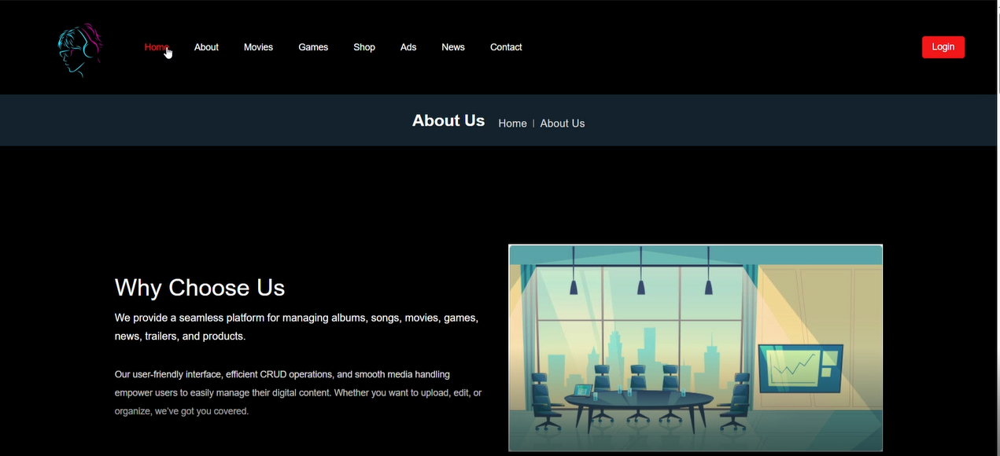
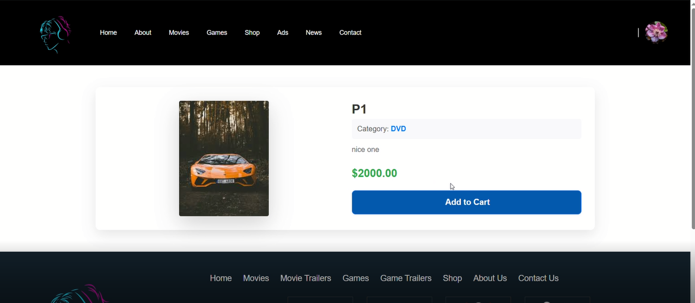
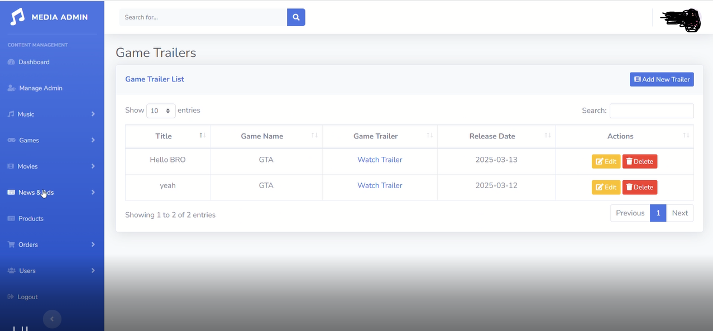

# Online DVD Store Website

This project is an ASP.NET-based website designed to provide users with relevant information about the latest releases in the fields of music, games, and movies. It allows users to browse, listen, watch trailers, and even order DVDs from the comfort of their homes.

## Features
The website offers the following features:
- **View Products**: Users can view a wide range of products, including music albums, games, and movies.
- **User Registration and Account Management**: Users can register, log in, and manage their accounts.
- **News Updates**: Read the latest news about music, games, and movies.
- **Browse by Category**: Browse products by categories like Artists, Albums, etc.
- **Place Orders**: Users can place orders and view their order history.
- **Rate and Comment**: Rate products and write comments about them.
- **Add to Cart**: Add products to their cart for purchasing later.
- **Play Media**: Play music, watch movie trailers, or game trailers directly on the website.
- **Download Media**: Download selected songs, movies, or games for free (with restrictions).
- **Feedback**: Send feedback to improve the website.
- **Create Collections**: Users can create and save their custom collections of music or videos.

## Interface
Below are some of the interface designs for the website:

